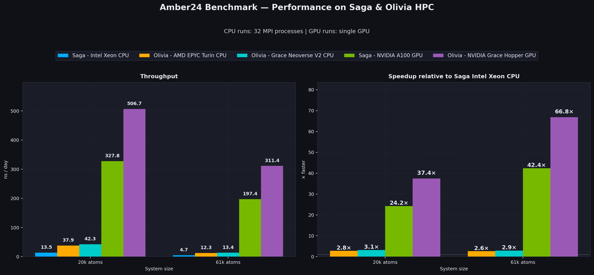
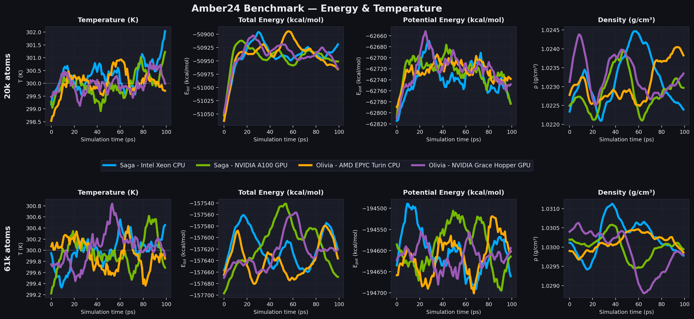

# Amber24-container

Dockerfiles and Singularity Definition Files (for `x86_64` and `aarch64` architectures) to build **Amber24** and **AmberTools25** with MVAPIch-4.1 and CUDA 12 support.

**Important:** The source code is not included in this repository because it requires signing an End User License Agreement (EULA).

### How to build

1. Go to the official Amber website: https://ambermd.org/GetAmber.php
2. Download the following files (non-commercial use):
   - `pmemd24.tar.bz2`
   - `AmberTools24.tar.bz2`
3. Place both files in the same directory as the relevant Dockerfile / definition file and `start.sh`
4. Build the container:

```
# For x86_64 (Docker)
docker build --progress=plain -t amber24_x86_64 -f Dockerfile_x86_64 .

# For aarch64 / Grace Hopper (Singularity)
singularity build amber24_aarch64.sif amber24_aarch64.def
```

## Benchmark results

Benchmarks were run on:
- Saga HPC
  - Intel Xeon CPUs (32 MPI processes)
  - NVIDIA A100 GPUs (single GPU)
- Olivia HPC
  - AMD EPYC Turin CPUs (32 MPI processes)
  - NVIDIA Grace Hopper GPUs (single GPU)

using a standard Amber benchmark suite (https://www.hecbiosim.ac.uk/file-store/benchmark-suite/amber.tar.xz) `20k-atoms` and `61k-atoms` examples.

### Performance summary

### Throughput and Speedup



- Left panel: Throughput in ns/day (higher is better)
- Right panel: Speedup relative to Saga Intel Xeon CPU (higher is better)

Note: CPU runs use 32 MPI processes; GPU runs use a single GPU.

### Energy & Temperature stability



- Temperature remains stable around 300 K
- Total energy is conserved (no drift)
- Density is stable
- Slight energy offsets between CPU (double precision) and GPU (single precision) are expected and documented in Amber

These results confirm that the container produces correct physical behavior and excellent performance on both architectures, with outstanding acceleration on Grace Hopper GPUs.

